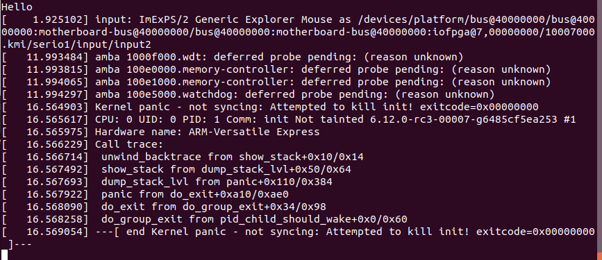

## Root file system

### 15sec-iniramfs
1. Write code
```c
#include <stdio.h>
#include <unistd.h>

int main() {
	printf("Hello\n");
	sleep(15);
	return 0;
}
```
2. Compile it
```console
arm-linux-gnueabihf-gcc -static init.c -o init
```
2. Make archive
```console
echo init | cpio -o -H newc | gzip > initramfs.cpio.gz
```
3. Run qemu
```console
QEMU_AUDIO_DRV=none qemu-system-arm -M vexpress-a9 -kernel zImage -initrd initramfs.cpio.gz -dtb vexpress-v2p-ca9.dtb -append "console=ttyAMA0" -nographic
```

### Busybox
1. Create default config file
2. Change options (build static library, cross compiler prefix)
3. Build busybox
4. Install
5. Make archive and move it to our folder
6. Run qemu

```console
ARCH=arm make defconfig
ARCH=arm make menuconfig
	Build static binary
	Cross compiler prefix 
make -j 6
make install
find . | cpio -o -H newc | gzip > initramfs.cpio.gz
QEMU_AUDIO_DRV=none qemu-system-arm -M vexpress-a9 -kernel zImage -initrd initramfs.cpio.gz -dtb vexpress-v2p-ca9.dtb -append "console=ttyAMA0 rdinit=/bin/ash" -nographic
```

